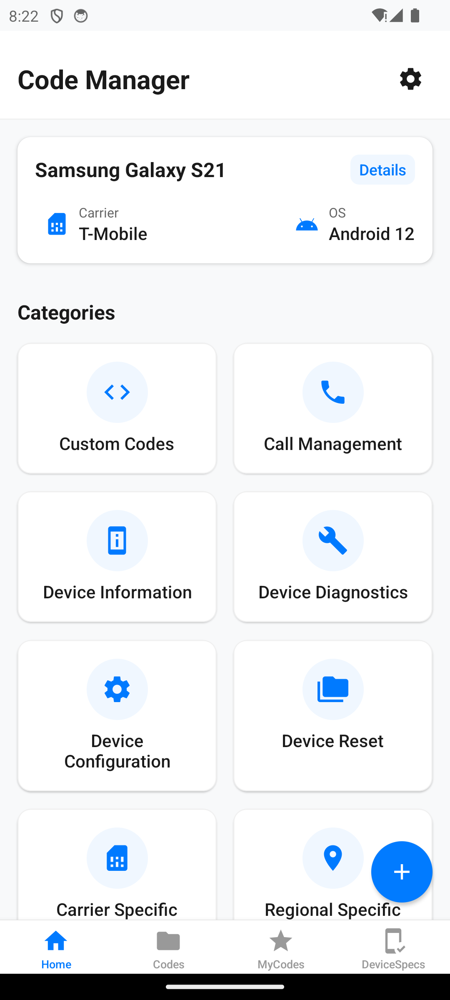
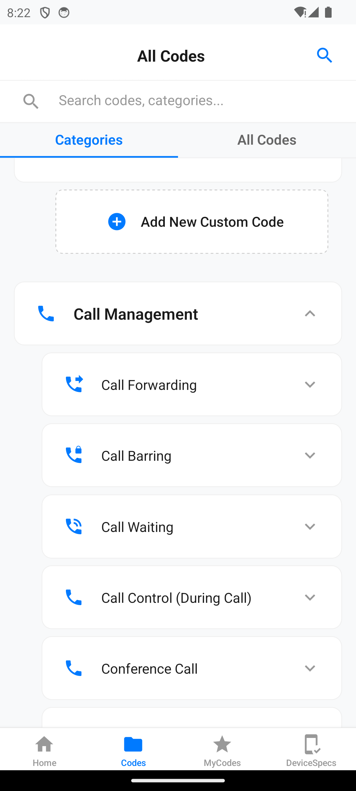
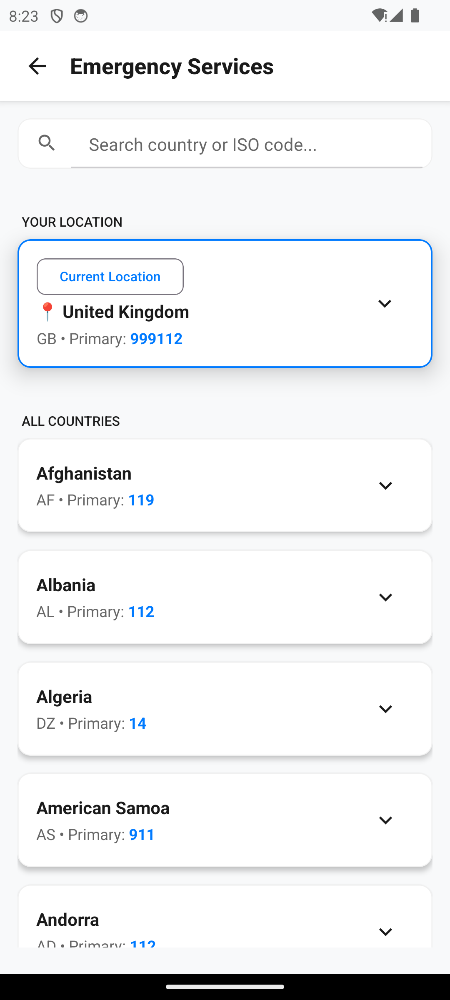

# USSD Code Manager

<p align="center">
  
</p>

## Overview

USSD Code Manager is a powerful mobile application designed to help users organize, save, and execute USSD (Unstructured Supplementary Service Data) codes. The app provides a user-friendly interface for managing service codes across different categories, making it easier to access essential mobile services without having to remember complex code combinations.

## Features

### Core Functionality
- **USSD Code Execution**: Execute USSD codes directly from the app
- **Category Organization**: Browse codes organized by categories and subcategories
- **Recent Activity Tracking**: View history of recently executed codes
- **Favorites System**: Save frequently used codes for quick access
- **Custom Codes**: Create and manage your own custom USSD codes

### Additional Features
- **Emergency Services**: Quick access to emergency service numbers with location awareness
- **Dark Mode Support**: Comfortable viewing in any lighting condition
- **Performance Optimized**: Fast and responsive, even with large datasets
- **Privacy Focused**: All data stored locally on device with no data collection

## Screenshots

<p align="center">
  
  
  
</p>

## Technical Details

### Built With
- **React Native**: Cross-platform mobile framework
- **React Navigation**: For screen navigation and routing
- **AsyncStorage**: For local data persistence
- **React Native Paper**: UI component library

### Architecture
The app follows a modular architecture with:
- Screen components for different views
- Utility services for data management
- Context providers for theme and state management
- Local storage for data persistence

## Installation

### Prerequisites
- Node.js (v18 or higher)
- React Native CLI
- Android Studio (for Android development)
- Xcode (for iOS development, macOS only)

### Setup
1. Clone the repository:
```sh
git clone https://github.com/yonasKu/Code-Manager.git
```

2. Install dependencies:
```sh
cd Code-Manager
npm install
```

3. Run the app:
```sh
# For Android
npm run android

# For iOS
npm run ios
```

## Usage

1. **Home Screen**: Access recent activities and category shortcuts
2. **Codes Tab**: Browse all available USSD codes by category
3. **My Codes Tab**: View and manage your custom USSD codes
4. **Emergency Services**: Access emergency numbers for different countries
5. **Settings**: Customize app behavior and appearance

## Privacy

USSD Code Manager respects your privacy:
- No data collection or transmission
- All information stored locally on your device
- No analytics or tracking
- Minimal permissions required

## Contributing

Contributions are welcome! Please feel free to submit a Pull Request.

## License

This project is licensed under the MIT License - see the LICENSE file for details.

## Contact

Yonas Kumelachew - [Yonijonahphineas0@gmail.com](mailto:Yonijonahphineas0@gmail.com)

Project Link: [https://github.com/yonasKu/Code-Manager](https://github.com/yonasKu/Code-Manager)
